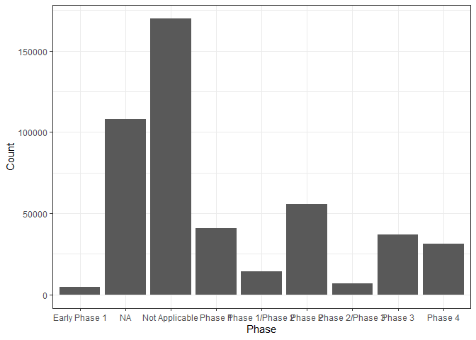

<!-- README.md is generated from README.Rmd. Please edit that file -->

# bis620.2023

<!-- badges: start -->

[](https://github.com/EmilyLin05/bis620.2023/actions/workflows/R-CMD-check.yaml)
[](https://github.com/EmilyLin05/bis620.2023/actions/workflows/test-coverage.yaml)
<!-- badges: end -->

The goal of bis620.2023 is to provide a comprehensive and user-friendly
platform for exploring and visualizing clinical trial data. Our app
emphasizes key aspects, including age, participation timeline,
collaborative leadership, and the nature of experiments. Users can
easily filter and analyze clinical trials based on these criteria,
gaining insights into the safety, effectiveness, and overall progress of
treatments. Additionally, the app offers spatial visualizations of
participating countries and an overview of trial statuses. This tool
aims to facilitate data-driven decision-making in healthcare research.
Explore the diverse world of clinical trials with bis620.2023 for
enhanced medical science and improved healthcare outcomes.

## Installation

You can install the development version of bis620.2023 from
[GitHub](https://github.com/) with:

``` r
# install.packages("devtools")
devtools::install_github("EmilyLin05/bis620.2023")
```

## Example

This is a basic example which shows you how to solve a common problem:

``` r
library(bis620.2023)
accel |> 
  head(100) |> 
  plot_accel()
```



## Test-coverage

This is the link to the test coverage report:
<https://app.codecov.io/gh/EmilyLin05/bis620.2023/tree/main/R>
